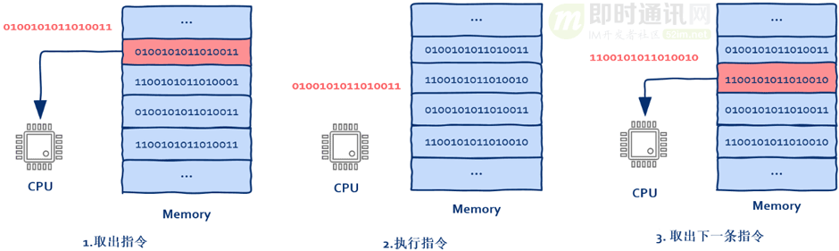

## 引用说明

文章内容来源自  [即时通信网](http://www.52im.net/) 的相关技术专栏，这里只是做学习、汇总和备份，所属版权归原作者所有，如有侵权请联系删除。

转载文章原地址：http://www.52im.net/thread-3272-1-1.html

## 1.1、系列文章引言

### 1.1.1、文章目的

作为即时通讯技术的开发者来说，高性能、高并发相关的技术概念早就了然与胸，`什么线程池`、`零拷贝`、`多路复用`、`事件驱动`、`epoll` 等等名词信手拈来，又或许你对具有这些技术特征的技术框架比如：Java的[Netty](https://netty.io/)、Php的[workman](https://www.workerman.net/)、Go的[nget](https://github.com/panjf2000/gnet)等熟练掌握。

但真正到了面视或者技术实践过程中遇到无法释怀的疑惑时，方知自已所掌握的不过是皮毛。

返璞归真、回归本质，`这些技术特征背后的底层原理到底是什么？如何能通俗易懂、毫不费力真正透彻理解这些技术背后的原理，正是《从根上理解高性能、高并发》系列文章所要分享的`。

### 1.1.2、文章源起

我（[Jack Jiang](http://www.52im.net/thread-2792-1-1.html)）为即时通讯网整理了相当多有关IM、消息推送等即时通讯技术相关的资源和文章，从最开始的开源IM框架[MobileIMSDK](https://github.com/JackJiang2011/MobileIMSDK)，到网络编程经典巨著《[TCP/IP详解](http://www.52im.net/topic-tcpipvol1.html?mobile=no)》的在线版本，再到IM开发纲领性文章《[新手入门一篇就够：从零开发移动端IM](http://www.52im.net/thread-464-1-1.html)》，以及网络编程由浅到深的《[网络编程懒人入门](http://www.52im.net/thread-1095-1-1.html)》、《[脑残式网络编程入门](http://www.52im.net/thread-1729-1-1.html)》、《[高性能网络编程](http://www.52im.net/thread-561-1-1.html)》、《[不为人知的网络编程](http://www.52im.net/thread-1003-1-1.html)》系列文章。

越往知识的深处走，越觉得对即时通讯技术了解的太少。于是后来，为了让开发者门更好地从基础电信技术的角度理解网络（尤其移动网络）特性，我跨专业收集整理了《[IM开发者的零基础通信技术入门](http://www.52im.net/forum.php?mod=collection&action=view&ctid=24&fromop=all)》系列高阶文章。这系列文章已然是普通即时通讯开发者的网络通信技术知识边界，加上之前这些网络编程资料，解决网络通信方面的知识盲点基本够用了。

对于即时通讯IM这种系统的开发来说，网络通信知识确实非常重要，但回归到技术本质，实现网络通信本身的这些技术特征：`包括上面提到的线程池、零拷贝、多路复用、事件驱动等等，它们的本质是什么？底层原理又是怎样？这就是整理本系列文章的目的，希望对你有用`。

### 1.1.3、本篇概述

本篇是该系列文章的开篇，主要是从CPU这一层来讲解多线程以及线程池原理，力求避免复杂的技术概念罗列，尽量做到通俗易懂、老少皆宜。

## 1.2、本文作者

应作者要求，不提供真名，也不提供个人照片。

本文作者主要技术方向为互联网后端、高并发高性能服务器、检索引擎技术，网名是“码农的荒岛求生”，公众号“[码农的荒岛求生](https://mp.weixin.qq.com/s/ODUTTBld00AsvHF9tXKonA)”。感谢作者的无私分享。

## 1.3、一切要从CPU说起

你可能会有疑问，讲多线程为什么要从CPU说起呢？原因很简单，在这里没有那些时髦的概念，你可以更加清晰的看清问题的本质。

**实际情况是：**CPU并不知道线程、进程之类的概念。

**CPU只知道两件事：**

- ***1）***从内存中取出指令；
- ***2）***执行指令，然后回到 1）。

